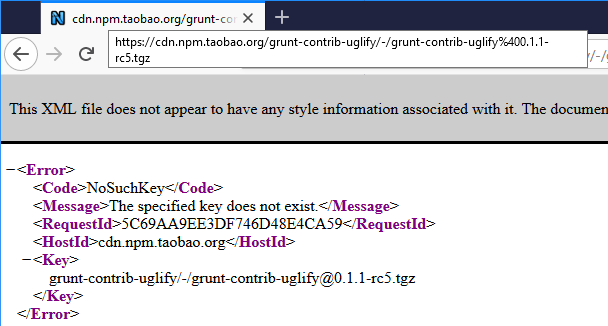

# gonepm
`gonepm` is a proof of concept Go package for interacting with npm-like registries. It was mainly created to test my hypothesis of backdooring packages in alternate npm repositories.

## The Idea
The official npm registry is filtered in some countries (mainly China). These countries have created their own npm registries that mirror the official one. The idea is that the owner of the alternate registry can backdoor packages because no one checks if the package is different from the original one.

This proof of concept looked at the top 1000000 packages with the most number of dependents on npm and compared the size of the tarball (more on that later) with the ones on the two China-specific ones. This was done for all package versions.

## Package Comparison
The surest way of doing that is downloading all files and calculating hashes. However, the latency to latencies in China registries made that very slow. As a result, I retrieved the size of the tarball using a `HEAD` request.

The `HEAD` request just returns a set of response headers. The `content-length` header contains the size of the file. This gave me a significant speed boost.

You can read more about it here:

* https://parsiya.net/blog/2018-12-04-cheap-integrity-checks-with-head/

## Weakness
This can be defeated by a determined attacker in specific scenarios. If the backdoored package has a smaller tarball, we can attach garbage to the end of it to reach the official package tarball size. Most utilities just extract the file and ignore the garbage in the end.

## Example
The package logs the results to the default log. We can redirect it to a file or use a `MultiWriter` to print to both standard output and a log file.


``` go
// Create log file.
f, err := os.Create("top1000-run-1.txt")
if err != nil {
    panic(err)
}
defer f.Close()

mw := io.MultiWriter(f, os.Stdout)
log.SetOutput(mw)
```

Get the top 1000 packages with the most number of dependents. These are prime backdoor targets:

``` go
// Get top 1000 dependent packages from github gist.
packages, err := gonepm.Top1000Dependents()
if err != nil {
    panic(err)
}
```

This method parses Avanka's list at https://gist.github.com/anvaka/8e8fa57c7ee1350e3491 and returns a string slice of package names. You can also pass in your own string slice of package names.

``` go
packages := []string{
	"lodash",
	"request",
	"chalk",
	"commander",
	"express",
	"react",
	"async",
	"debug",
	"bluebird",
	"yargs",
	"q",
	"vue",
	"gulp",
	"@angular/core",
	"optimist",
	"co",
}
```

Define the registry endpoints. In this case, I am setting up the official npm registry and two China-specific ones:

``` go
// Define registries.
registries := []string{
    "https://registry.npmjs.com/",
    "http://registry.npm.taobao.org",
    "https://registry.cnpmjs.org/",
}
```

You can pass your own internal registry endpoint as long as it is compatible with the RFC (I have forgotten the RFC number but there's an IETF RFC that defines the API). TODO: Find that RFC number.

Create registries from the slice:

``` go
// Make registries.
regz, err := gonepm.MakeRegistries(registries)
if err != nil {
    panic(err)
}
```

You can also make an individual registry with `gonepm.NewRegistry`.

Compare. `counter` returns the number of discrepancies between registries. This is counted per package version, meaning on package might have multiple discrepancies in its different versions. Discrepancies are printed to `log`.

``` go
counter, err := gonepm.ComparePackages(regz, packages)
if err != nil {
    panic(err)
}
fmt.Println("Number of differences:", counter)
fmt.Println("Done")
```

Look inside `test/main.go` for an example. You will see something like this:

```
2018/10/11 11:51:10 Comparing package grunt-contrib-uglify
2018/10/11 11:51:10 Retrieving package grunt-contrib-uglify sizes from http://registry.npm.taobao.org
2018/10/11 11:51:10 Retrieving package grunt-contrib-uglify sizes from 
2018/10/11 11:51:11 Retrieved package grunt-contrib-uglify sizes from https://registry.npmjs.com
2018/10/11 11:51:13 Retrieved package grunt-contrib-uglify sizes from http://registry.npm.taobao.org
2018/10/11 11:51:13 Registry with largest number of versions: BaseURL: https://registry.npmjs.com - db_name: registry - doc_count: 1023521
2018/10/11 11:51:13 Comparing 47 versions.
2018/10/11 11:51:13 Sizes do not match for package grunt-contrib-uglify version 0.1.1-rc5.
2018/10/11 11:51:13 Size: 10613 - URL: https://registry.npmjs.com/grunt-contrib-uglify/-/grunt-contrib-uglify@0.1.1-rc5.tgz.
2018/10/11 11:51:13 Size: 295 - URL: http://registry.npm.taobao.org/grunt-contrib-uglify/-/grunt-contrib-uglify@0.1.1-rc5.tgz.
2018/10/11 11:51:13 Sizes do not match for package grunt-contrib-uglify version 0.1.1-rc6.
2018/10/11 11:51:13 Size: 10689 - URL: https://registry.npmjs.com/grunt-contrib-uglify/-/grunt-contrib-uglify@0.1.1-rc6.tgz.
2018/10/11 11:51:13 Size: 295 - URL: http://registry.npm.taobao.org/grunt-contrib-uglify/-/grunt-contrib-uglify@0.1.1-rc6.tgz.
2018/10/11 11:51:13 Finished comparing sizes for grunt-contrib-uglify
```

In this case, `grunt-contrib-uglify@0.1.1-rc5` and `rc6` do not exist on `registry.npm.taobao.org`. The `HEAD` request returns the size of the error page which is different from the package name in `registry.npmjs.com`.



# License
MIT. See [LICENSE](license) for details.

# TODO

1. ~~Remove un-needed json fields from search results and metadata.~~
2. ~~goroutines for single HEADs, getsize, and compares.~~
3. Store results in a local database, bolt DB?
4. Find more alternate npm mirrors. We currently have:
   1. https://registry.npmjs.com
   2. https://registry.npm.taobao.org
   3. https://registry.cnpmjs.org/
